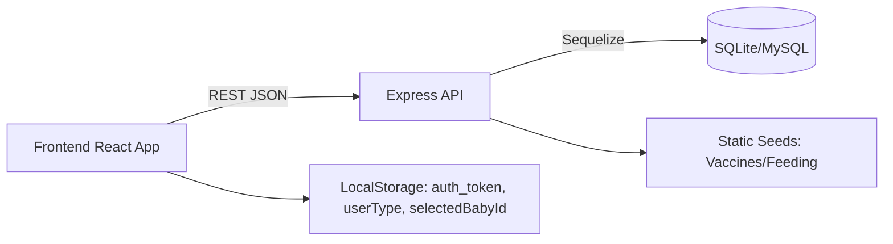
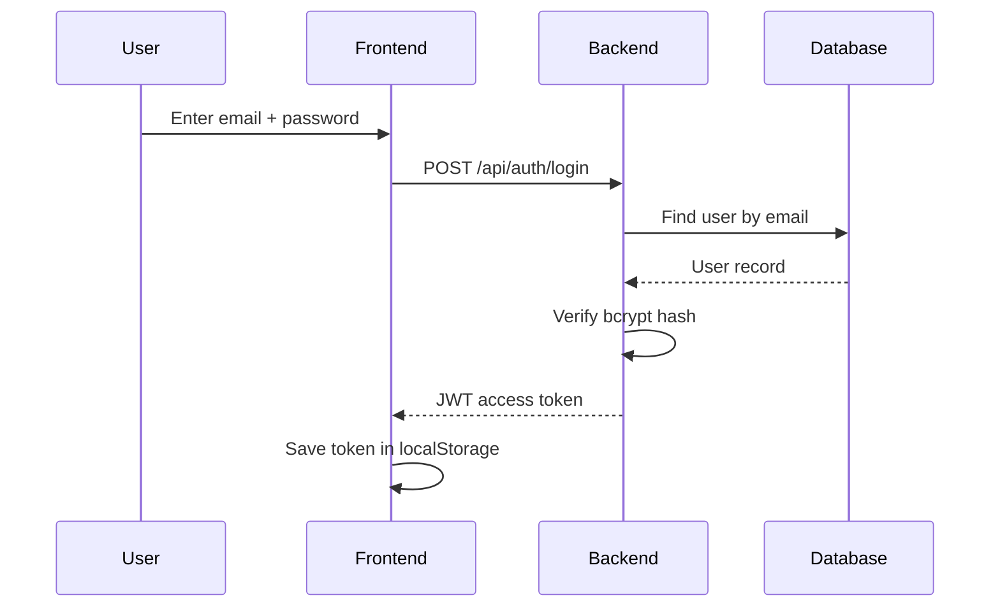

# NutriTrack Project Overview (Detailed)

NutriTrack is a full-stack web and mobile-friendly app that helps users manage pregnancy and baby care. It provides secure authentication, baby profiles, growth tracking, guidance content, reminders, and vaccines. The system is split into a backend REST API (Node.js + Express + Sequelize) and a frontend app (React + Vite), connected via JSON over HTTP with JWT-based authentication.

## Purpose and Scope
- Support new and expecting parents with baby profile management and weekly growth tracking.
- Provide structured guidance content (nutrition, feeding, vaccines).
- Keep data secure with password hashing and token-based access control.

## Tech Stack
- Frontend: React, Vite, React Router, custom hooks, context state.
- Backend: Node.js, Express, Sequelize ORM.
- Database: SQLite by default; MySQL supported through `DATABASE_URL`.
- Auth: bcrypt password hashing + JWT access tokens.

## Architecture Overview
The frontend renders UI and calls backend endpoints through a centralized API client. The backend exposes REST endpoints, validates auth tokens, and uses Sequelize models to read/write the database. Static datasets (vaccines and feeding guides) are seeded on startup.

## Visual Representation

## Backend (How It Works)
### Database Connection and Sync
- DB connection is created on server startup.
- Sequelize authenticates and syncs models with `alter: true` to keep tables updated.
- SQLite foreign keys are temporarily disabled during sync, then re-enabled.

### Models and Relationships
- `User` stores account data and auth fields.
- `Baby` stores baby profile data and belongs to a user.
- `GrowthRecord` stores measurement data and links to both user and baby.
- Relationships: User has many Babies; Baby has many GrowthRecords; GrowthRecord belongs to User and Baby.

### Controllers and Routes
- Controllers implement business logic (create, read, update, delete).
- Routes map endpoints to controllers and apply auth middleware.
- Example groups: `/api/auth`, `/api/babies`, `/api/growth`, `/api/reminders`, `/api/vaccines`, `/api/static`, `/api/profile`.

### Authentication and Security
- Password strength is validated server-side before account creation.
- Passwords are hashed with bcrypt and stored as `hashed_password`.
- Login verifies password and issues a JWT access token.
- Auth middleware validates `Authorization: Bearer <token>` and attaches `req.user`.

## Frontend (How It Works)
### Routing and Pages
- Login and Signup handle authentication flows.
- Growth page handles baby list, growth records, charts, and milestones.
- Add Baby is a dedicated page for creating new baby profiles.

### State Management
- `BabyContext` loads babies on app start (if token exists).
- The currently selected baby is saved to `localStorage`.
- Local UI state is managed with React hooks (`useState`, `useEffect`).

### API Client Layer
- `api.js` wraps `fetch` with:
  - Base URL config
  - Automatic JWT header injection
  - Error handling and response parsing
- All frontend pages call this API layer instead of `fetch` directly.

## Key Data Flows
### Sign Up Flow
1. User fills the Signup form (client validation).
2. Frontend sends `/api/auth/register`.
3. Backend validates password strength, checks email uniqueness, hashes password, creates user.
4. Frontend navigates to Login on success.

### Login Flow
1. User enters credentials on Login page.
2. Frontend calls `/api/auth/login`.
3. Backend verifies credentials and returns a JWT.
4. Frontend stores token and fetches current user profile.

### Baby Create/Update/Delete Flow
1. Baby form validates name and date of birth.
2. Frontend calls `/api/babies` (POST/PUT/DELETE).
3. Backend creates or updates the Baby model.
4. Frontend updates context state and refreshes UI.

### Growth Record Flow
1. Growth input validates weight and height.
2. Frontend calls `/api/growth/records` (POST/GET/DELETE).
3. Backend writes GrowthRecord and returns updated data.
4. Growth page updates charts and tables.

## Visual Sequence Example (Login)

## Data Storage
- Default: SQLite file database for local/dev usage.
- Optional: MySQL via `DATABASE_URL`.
- Sequelize models define all tables and relationships.

## Why It Works End-to-End
- Frontend validates input and uses a single API client for network calls.
- Backend enforces auth, runs validations, and persists data via Sequelize.
- Context state and localStorage keep the UI consistent across sessions.

## Notes and Constraints
- JWT secret should be set securely in production.
- Email format validation is strict on the frontend; backend only checks uniqueness.
- Soft delete is used for babies (`is_active = false`).

---

