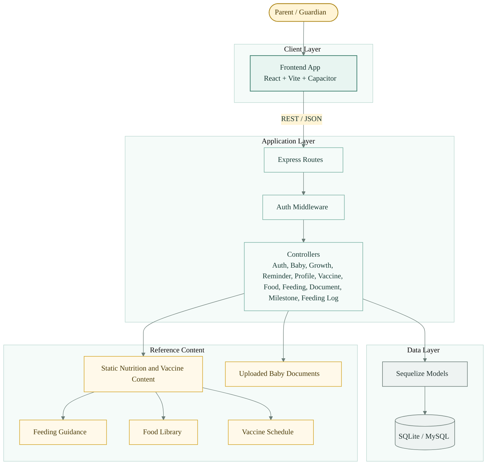
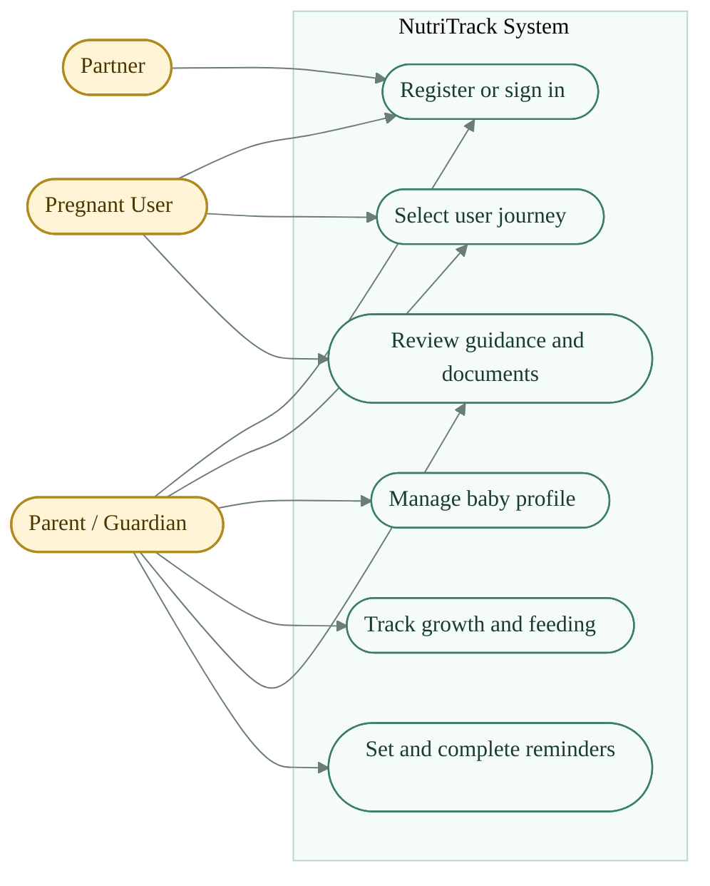
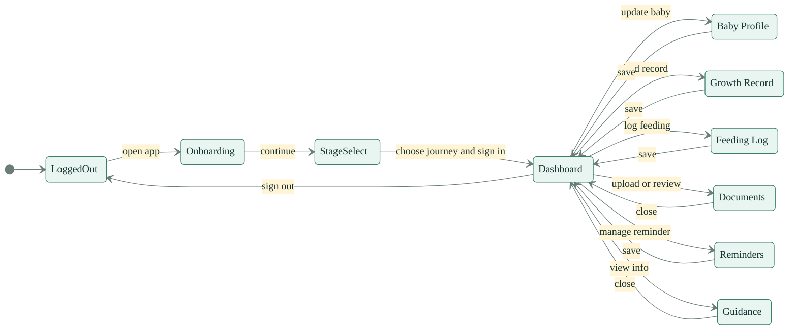
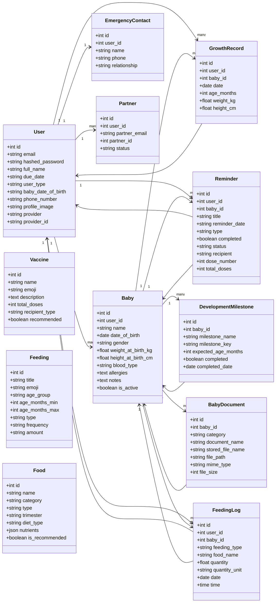
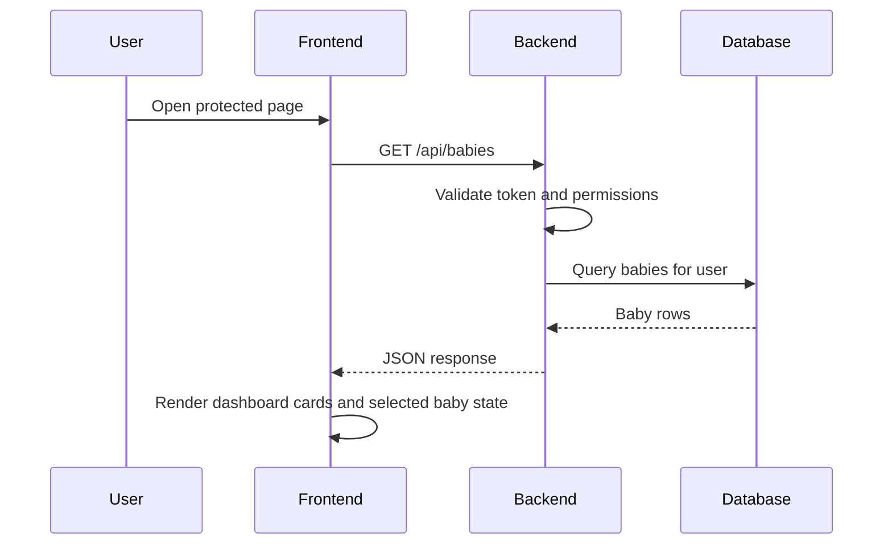

# NutriTrack System Diagrams

This document collects the main diagrams for NutriTrack in one place. The styling is intentionally clean and health-focused, with a green-and-gold palette that matches the product's nutrition and family-care theme.

## 1. Block Diagram

## 2. Use Case Diagram

## 3. State Chart Diagram

## 4. Class Diagram

## 5. API Flow Sequence

